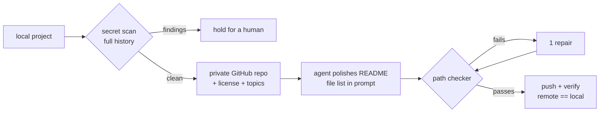
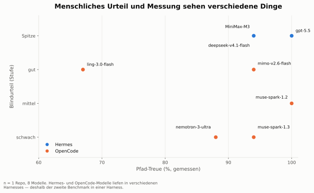

# make-all-repos-public

**Put a year of forgotten local projects on GitHub in one night — without leaking a secret, and without letting an AI invent your README.**

I had ~200 local projects and almost none of them on GitHub. This repo is how I fixed that with coding agents: a publication procedure with hard safety gates, and **README-Bench**, a small blind benchmark that measured which models write honest READMEs about code they did not write.

→ **Website with results and a swipeable blind gallery: [smlfg.github.io/make-all-repos-public/site](https://smlfg.github.io/make-all-repos-public/site/)**

## The one thing to take away

**Give the model the file list, then check its work with a script.** Same model, same 16 READMEs, one change — the output of `git ls-files` in the prompt: path fidelity went from **61 % to 100 %**, invented paths from **28 to 0**. That single trick mattered more than which model we picked.

## How it works



Every step that can leak or lie has a deterministic gate. The agent writes; scripts decide.

## Safety gates

| Gate | Stops | Where |
|---|---|---|
| Secret scan over the **full history**, not just the working tree | tokens and keys in old commits | [`skill/SKILL.md`](skill/SKILL.md), step 2 (`gitleaks git` + `gitleaks dir`) |
| **Private first** — publishing makes repos private; going public is a separate human decision | accidental exposure | [`scripts/publish.sh`](scripts/publish.sh) |
| **Scope guard** — `git status` before/after every agent run; any change outside `README.md` is flagged | agents editing your code | [`scripts/polish-one.sh`](scripts/polish-one.sh) |
| **Path checker** — every path the README names in backticks must exist | invented files and folders | [`scripts/grounding.py`](scripts/grounding.py) |
| **Read-back** — after each push, remote `HEAD` must equal local `HEAD` | "pushed" that didn't push | [`scripts/push-all.sh`](scripts/push-all.sh) |

One lesson from building this: an LLM reviewer is not a secret scanner. Asked to vet 21 repos, the agent recommended publishing **9 repos where `gitleaks` had findings** — including real access tokens. Only publish what both the scanner and the agent clear. ([details](results/05-agent-vs-scanner/ERGEBNIS.md))

## Use it

The portable part is the agent skill; the scripts are the reference implementation I ran.

**Prerequisites:** `git`, `gh` (authenticated), [`gitleaks`](https://github.com/gitleaks/gitleaks), `python3`.

**Quickstart — one project, by hand, the way the skill does it:**

```bash
cd path/to/your-project
git status --short --branch; git remote -v; gh api user --jq '.login'   # know where you are
gitleaks git . --no-banner --redact     # whole history — stop on any finding
gitleaks dir . --no-banner --redact     # files about to be added
gh repo create your-project --private --source . --remote origin --push
git ls-remote origin HEAD; git rev-parse HEAD                            # must match
```

**With an agent:**

1. **Give it the skill:** [`skill/SKILL.md`](skill/SKILL.md) — local state → scan → collision check → private repo → read-back → license → topics, plus a *Repository Polish Pass* for READMEs. Written for a Hermes agent, but plain Markdown any shell-capable coding agent can follow.
2. **Polish the README** with [`scripts/polish-section.md`](scripts/polish-section.md) as instructions — and paste the output of `git ls-files` into the prompt.
3. **Gate it:** [`scripts/grounding.py`](scripts/grounding.py) takes a file with one repo folder per line and prints path fidelity plus every invented path. Commit only at 100 %.

> **Honest status:** the batch scripts ([`scripts/run-publish.sh`](scripts/run-publish.sh), [`scripts/polish-one.sh`](scripts/polish-one.sh), [`scripts/push-all.sh`](scripts/push-all.sh)) are wired to my machine — `$HOME/Projekte`, my GitHub user, a Hermes agent profile, input lists that stay private. Read them as working examples, not as an installer.

## README-Bench — one harness, two repos, blind verdict

Same task, same skill section, same file list, **one harness** (OpenCode) for all eight models, judged **blind**: the judge saw letters A–H only; models were revealed afterwards. Winner: **muse-spark-1.2 — free, top in both repos.**

| Model | hai-mcp | Sidecar-ng | Cost |
|---|---|---|---|
| muse-spark-1.2 | **top** · 82 % | **top** · 100 % | free |
| deepseek-v4.1-flash | **top** · 81 % | good · 100 % | subscription |
| muse-spark-1.3 | **top** · 80 % | good · 100 % | free |
| gpt-5.5 | good · 100 % | good · 100 % | subscription |
| mimo-v2.6-flash | weak (too long) · 83 % | good · 100 % | free |
| ling-3.0-flash | good · 79 % | weak (off-task) · 73 % | free |
| nemotron-3-ultra | weak · 85 % | okay · 67 % | free |
| nemotron-3.5-lightning | — (no change) | okay · 100 % | free |

*Verdict · path fidelity.* The hai-mcp original README itself scores 74 %: the "missing" paths are runtime artifacts and placeholders, not inventions — across all eight hai-mcp READMEs exactly one path was actually made up.

<picture>
  <source media="(prefers-color-scheme: dark)" srcset="docs/assets/blind-vs-metric-dark.svg">
  
</picture>

**What the numbers say**

- **With a file list and a checker, a free model wrote the best READMEs** (muse-spark-1.2, top in both repos).
- **Blind judgment and metrics disagree** — gpt-5.5 hit 100 % fidelity in both repos and was never rated top; in the first blind test a 67 % README was rated "good". You need both.
- **Harness skews comparisons.** The first test ran paid models in one harness and free models in another, and paid models looked better. In one harness, they didn't.
- **Length is a verdict.** The longest README (373 lines) was rated weak: *"I wouldn't read that as a stranger."*

Full data: [`site/data/results.json`](site/data/results.json) · write-ups in [`results/`](results/) (German).

## Limitations

- **n = 2 repos, 1 judge.** A tendency, not a law.
- **MiniMax-M3 excluded** from the main benchmark — its provider returned 401 (invalid key), an access problem, not a model result.
- **The checker knows no placeholders** — `<project>/…` or files created at runtime count as "invented".
- **Fidelity checks existence, not meaning.** Whether a description is *true* is what the blind verdict is for.
- **One judge verdict was inferred from order** where the letter wasn't spoken in the recording (marked in the data).

## Repository

| Path | What |
|---|---|
| [`skill/SKILL.md`](skill/SKILL.md) | the agent skill — start here |
| [`scripts/`](scripts/) | reference scripts: publish, polish, repair, push, path checker, analysis, charts |
| [`results/`](results/) | five write-ups: first comparison, blind test 1, manifest mini-test, benchmark 2, agent vs. scanner |
| [`site/`](site/) | the website ([`site/index.html`](site/index.html)) and its data |
| [`docs/assets/`](docs/assets/) | charts, light and dark |
| [`GOAL.md`](GOAL.md) · [`FOR_SMLFLG.md`](FOR_SMLFLG.md) | goal and lessons learned (German) |

## License

MIT — see [`LICENSE`](LICENSE).

Built by Samuel Fleig with coding agents: Claude orchestrated, several models wrote, scripts decided.
