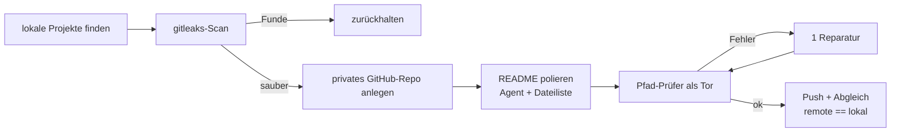

# Charts

Erzeugt mit `python3 scripts/make_charts.py` (matplotlib, keine neuen Abhängigkeiten).
Jedes Chart existiert als Light/Dark-Paar; `<picture>` wählt automatisch nach
`prefers-color-scheme`.

## Manifest-Effekt

Zwei Kennzahlen-Kacheln: Pfad-Treue und Anzahl erfundener Pfade, jeweils vorher/nachher.

```html
<picture>
  <source media="(prefers-color-scheme: dark)" srcset="docs/assets/manifest-effect-dark.svg">
  
</picture>
```

## Blindurteil vs. Messung

Streudiagramm: Pfad-Treue (x, gemessen) gegen Blindurteil-Stufe (y, ordinal), Farbe nach Harness.

```html
<picture>
  <source media="(prefers-color-scheme: dark)" srcset="docs/assets/blind-vs-metric-dark.svg">
  
</picture>
```

## Pipeline



## Palette-Validator-Verdict

```
$ node .../dataviz/scripts/validate_palette.js "#2a78d6,#eb6834" --mode light --surface "#fcfcfb"
Palette (light, surface #fcfcfb, categorical): 2 slots
  [PASS] Lightness band         all 2 inside L 0.43–0.77
  [PASS] Chroma floor           all 2 >= 0.1
  [PASS] CVD separation         worst adjacent #eb6834↔#2a78d6 ΔE 24.7 (protan) · tritan 32.7
  [PASS] Normal-vision floor    worst adjacent #eb6834↔#2a78d6 ΔE 33.6 (normal)
  [PASS] Contrast vs surface    all 2 >= 3:1
  → ALL CHECKS PASS

$ node .../dataviz/scripts/validate_palette.js "#3987e5,#d95926" --mode dark --surface "#1a1a19"
Palette (dark, surface #1a1a19, categorical): 2 slots
  [PASS] Lightness band         all 2 inside L 0.48–0.67
  [PASS] Chroma floor           all 2 >= 0.1
  [PASS] CVD separation         worst adjacent #d95926↔#3987e5 ΔE 26.8 (protan) · tritan 32.4
  [PASS] Normal-vision floor    worst adjacent #d95926↔#3987e5 ΔE 31.8 (normal)
  [PASS] Contrast vs surface    all 2 >= 3:1
  → ALL CHECKS PASS
```
