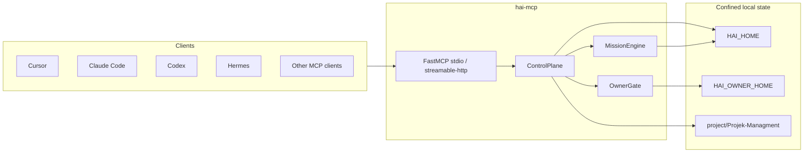

# HAI-MCP

**HAI-MCP is the open-source MCP control-plane implementation of Human Agent Interface (HAI), created by Samuel Fleig.**

It gives AI coding clients a shared, durable contract for agentic work: what is in scope, which session may act, what must be parked, and what counts as done. The server is model-agnostic: Claude Code, Cursor, Codex, Grok, OpenCode, Hermes, and any other MCP client can call the same tools.

The server itself never calls an LLM.

- Canonical website: https://www.human-agent-interface.com/
- About Samuel Fleig: https://www.human-agent-interface.com/samuel/
- Package: `hai-mcp` v0.1.0, Python 3.12+, MCP SDK `<2`

## Quick start

```bash
git clone https://github.com/smlfg/hai-mcp.git
cd hai-mcp
uv sync --all-extras
uv run hai-mcp
```

By default the server speaks stdio MCP.

Point your MCP client at it, adjusting paths for your machine:

```json
{
  "mcpServers": {
    "hai": {
      "command": "uv",
      "args": ["run", "--directory", "/absolute/path/to/hai-mcp", "hai-mcp"],
      "env": {
        "HAI_HOME": "/home/you/.hai",
        "HAI_OWNER_HOME": "/home/you/.hai-owner"
      }
    }
  }
}
```

Ready-made examples live in `docs/client-snippets/`.

After connecting, call:

- `hai_health` — server, config, owner-gate mode, optional project path check
- `hai_status` — active lanes, focus, inbox count, pending owner challenges
- `hai_check_git_hygiene` — classify client-reported Git dirtiness without running Git

## Repository structure

| Path | Purpose |
| --- | --- |
| `src/hai_mcp/` | Server + control-plane logic |
| `tests/` | Unit + gate tests |
| `docs/client-snippets/` | MCP client config examples |
| `docs/TOOL_CONTRACT.md` | Tool mutation/gate matrix, paths, artifact names, errors |
| `docs/OWNER_GATE.md` | Owner-gate design and modes |
| `docs/BUILD_HANDOFF.md` | Build handoff and verification history |
| `docs/visuals/` | Architecture and lifecycle diagrams (SVG + PNG) |
| `docs/wireframes/` | Mission lifecycle UX model |
| `GOAL.md` | Current slice goal and active boundaries |
| `FOR_SMLFLG.md` | Architecture, decisions, lessons-learned for this repo |
| `AGENTS.md` | Contributor rules for agents working in this repo |

## State and paths

| Location | Purpose |
| --- | --- |
| `HAI_HOME` (default `~/.hai`) | Global control-plane state: active context, inbox, missions, leases, audit, checkpoints, skill log |
| `HAI_OWNER_HOME` (default `~/.hai-owner`) | Owner-channel files for one-time approval codes; must not be inside `HAI_HOME` |
| `<project>/Projek-Managment/` | Per-project run-contract artifacts such as `NEXT_STEP.md` and `NEXT_STEP.proposed.md` |

Do not sync `HAI_HOME` with Dropbox, Syncthing, Git, or similar file mirroring. The store contains local paths and lock-protected state. Use the HTTP transport or a single writer process for multi-client access.

## Workflow & safety boundaries

**What HAI-MCP is not:**
- an LLM or agent runtime
- a harness executor
- an OS sandbox or adversarial security layer
- a semantic verifier for whether the model "really understood" the goal
- a commit, push, deploy, or delete tool
- a cloud sync system for `HAI_HOME`

Its job is the contract layer: explicit scope, explicit leases, explicit gates, explicit evidence.

**Git hygiene gate** — The server never shells out to `git`, parses `.git`, commits, stashes, pushes, or mutates repository state. Clients/adapters collect status and pass telemetry as `git_hygiene={"uncommitted_files": [...]}`. Modes: `off`, `advisory`, `required` (blocks on pause threshold). See `docs/TOOL_CONTRACT.md` for full matrix.

**Owner gate** — The owner is a separate principal from the agent. Default mode is `nonce`: one-time code delivered through `file` or `ntfy`, verified by server, consumed on use. Alternative modes: `presence` (local fingerprint via `fprintd-verify`), `ack_legacy` (compatibility, not a real owner boundary). Details: `docs/OWNER_GATE.md`.

**Fail-closed defaults** — All gates default to blocking. No LLM calls inside the server. Path confinement via `src/hai_mcp/paths.py`. No secrets in configs.

## Architecture



Source layout:

| Path | Purpose |
| --- | --- |
| `src/hai_mcp/server.py` | MCP tool registration and transport entry point |
| `src/hai_mcp/state.py` | Control-plane operations and daily flow tools |
| `src/hai_mcp/mission.py` | Mission contracts, leases, activity policy, closure |
| `src/hai_mcp/owner_gate.py` | Nonce, presence, and legacy owner-gate modes |
| `src/hai_mcp/paths.py` | Root confinement and symlink-safe path handling |
| `src/hai_mcp/projects.py` | Logical project ids and device mounts |

## Visual assets

- `docs/visuals/hai-mcp-mission-lifecycle.svg` — Mission lifecycle state machine
- `docs/visuals/hai-mcp-mission-lifecycle.png` — PNG fallback for the lifecycle diagram

Full diagram gallery: `docs/DIAGRAMS.md` (to be created).

## Transport

Default transport is stdio:

```bash
uv run hai-mcp
```

Optional streamable HTTP for trusted local multi-client access:

```bash
uv run hai-mcp --transport streamable-http --host 127.0.0.1 --port 8765
```

Non-loopback HTTP binds require `HAI_HTTP_TOKEN`. The HTTP transport is not an adversarial owner-authentication layer; it is a way for clients to talk to one writer process.

## Tests

Use an isolated `HAI_HOME` when running experiments or tests.

```bash
uv sync --all-extras
uv run pytest
```

## Documentation

| Document | Purpose |
| --- | --- |
| `GOAL.md` | Current slice goal and active boundaries |
| `docs/TOOL_CONTRACT.md` | Tool mutation/gate matrix, paths, artifact names, errors |
| `docs/OWNER_GATE.md` | Owner-gate design and modes |
| `docs/client-snippets/` | MCP client config examples |
| `docs/BUILD_HANDOFF.md` | Build handoff and verification history |
| `docs/wireframes/2026-07-22-mission-contract-lifecycle/` | Mission lifecycle state and UX model |
| `AGENTS.md` | Contributor rules for agents working in this repo |

## Legacy

`~/.config/hai-agent-mcp` is Hermes-coupled prior art. This repo replaces that role for control-plane work. Coexistence is fine until you switch clients deliberately.

## Lineage

This repository was extracted from the `hai-sidecar` workspace (Sidecar V8 evolution) as a standalone MCP control-plane server. The `docs/plans/` directory retains the hardening slices (fail-closed, flow-tools) that led to the current architecture. See `docs/plans/2026-07-22-failclosed-hardening-SLICE.md` and related plans for the decision trail.