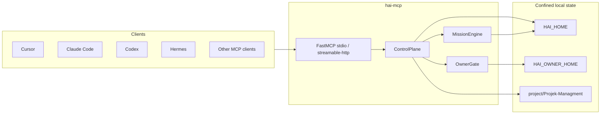

# HAI-MCP

**HAI-MCP is the open-source MCP control-plane implementation of Human Agent Interface (HAI), created by Samuel Fleig.**

It gives AI coding clients a shared, durable contract for agentic work: what is in scope, which session may act, what must be parked, and what counts as done. The server is model-agnostic: Claude Code, Cursor, Codex, Grok, OpenCode, Hermes, and any other MCP client can call the same tools.

The server itself never calls an LLM.

- Canonical website: https://www.human-agent-interface.com/
- About Samuel Fleig: https://www.human-agent-interface.com/samuel/
- Package: `hai-mcp` v0.1.0, Python 3.12+, MCP SDK `<2`

## The problem

Agents are good at executing. They are bad at keeping a stable contract in their own head.

Without a control plane, three things happen:

1. The goal softens as the chat gets longer.
2. Side ideas become work before the owner decided that they should.
3. "Done" becomes a claim instead of evidence.

HAI-MCP solves that by moving the working agreement out of the model and into a deterministic local server.

## What HAI-MCP does

HAI-MCP is a local-first MCP server that manages:

- project run-contract artifacts such as `NEXT_STEP.md`
- active focus lanes and parked thoughts
- bounded missions with versioned contracts
- time-limited session leases for agents
- deterministic activity checks against a contract
- owner-gated changes that fail closed
- evidence-based mission closure
- day-stop and recovery flows

Clients call tools. The server validates, writes confined local state, and returns structured JSON.

## What it is not

HAI-MCP is deliberately narrow.

It is not:

- an LLM or agent runtime
- a harness executor
- an OS sandbox or adversarial security layer
- a semantic verifier for whether the model "really understood" the goal
- a commit, push, deploy, or delete tool
- a cloud sync system for `HAI_HOME`

Its job is the contract layer: explicit scope, explicit leases, explicit gates, explicit evidence.

## Quick start

```bash
git clone https://github.com/smlfg/hai-mcp.git
cd hai-mcp
uv sync --all-extras
uv run hai-mcp
```

By default the server speaks stdio MCP.

Point your MCP client at it, adjusting paths for your machine:

```json
{
  "mcpServers": {
    "hai": {
      "command": "uv",
      "args": ["run", "--directory", "/absolute/path/to/hai-mcp", "hai-mcp"],
      "env": {
        "HAI_HOME": "/home/you/.hai",
        "HAI_OWNER_HOME": "/home/you/.hai-owner"
      }
    }
  }
}
```

Ready-made examples live in `docs/client-snippets/`.

After connecting, call:

- `hai_health` — server, config, owner-gate mode, optional project path check
- `hai_status` — active lanes, focus, inbox count, pending owner challenges
- `hai_check_git_hygiene` — classify client-reported Git dirtiness without running Git

## First files to read

If you are new to this repo, read in order:

1. `AGENTS.md` — contributor rules and required read order
2. `GOAL.md` — active slice thesis, scope, and acceptance checks
3. `docs/TOOL_CONTRACT.md` — tool gate matrix, paths, and error codes
4. `docs/OWNER_GATE.md` — owner-gate modes and challenge flow
5. `FOR_SMLFLG.md` — latest slice feature notes (2026-09-13)
6. `docs/BUILD_HANDOFF.md` — verified state, defects, and remaining build plan

## Repository structure

Compact top-level map — every path below exists in this repo:

| Path | Purpose |
| --- | --- |
| `AGENTS.md` | Agent rules; one WIP slice, fail-closed gates |
| `GOAL.md` | Canonical slice goal (single-writer central core) |
| `FOR_SMLFLG.md` | 2026-09-13 freshness / retry / checkpoint notes |
| `pyproject.toml` | Package `hai-mcp` v0.1.0, Python 3.12+, entry `hai-mcp` |
| `src/hai_mcp/server.py` | MCP registration and stdio / streamable-http transport |
| `src/hai_mcp/mission.py` | Contracts, leases, activity policy, closure |
| `src/hai_mcp/state.py` | Control-plane and daily-flow operations |
| `src/hai_mcp/owner_gate.py` | Nonce / presence / `ack_legacy` gates |
| `src/hai_mcp/paths.py` | Root confinement and symlink-safe handling |
| `docs/TOOL_CONTRACT.md` | Mutation/gate matrix and artifact names |
| `docs/OWNER_GATE.md` | Nonce delivery and presence verification |
| `docs/BUILD_HANDOFF.md` | Handoff with verified state and defects |
| `docs/visuals/hai-mcp-mission-lifecycle.svg` | Mission lifecycle visual (exact-text) |
| `docs/client-snippets/README.md` | Client config examples (Claude Code, Cursor) |
| `tests/test_mission_lifecycle.py` | Core lifecycle tests (representative) |
| `scripts/stdio_smoke.py` | Stdio smoke harness |

Visual `docs/visuals/hai-mcp-mission-lifecycle.png` is a failed ImageMagick render — see `docs/BUILD_HANDOFF.md` — use the SVG.

## State and paths

| Location | Purpose |
| --- | --- |
| `HAI_HOME` (default `~/.hai`) | Global control-plane state: active context, inbox, missions, leases, audit, checkpoints, skill log |
| `HAI_OWNER_HOME` (default `~/.hai-owner`) | Owner-channel files for one-time approval codes; must not be inside `HAI_HOME` |
| `<project>/Projek-Managment/` | Per-project run-contract artifacts such as `NEXT_STEP.md` and `NEXT_STEP.proposed.md` |

Do not sync `HAI_HOME` with Dropbox, Syncthing, Git, or similar file mirroring. The store contains local paths and lock-protected state. Use the HTTP transport or a single writer process for multi-client access.

## Git hygiene gate

HAI-MCP can warn or pause new agentic work when a client reports too many uncommitted files. The server never shells out to `git`, parses `.git`, commits, stashes, pushes, or mutates repository state. Clients/adapters collect status and pass telemetry as `git_hygiene={"uncommitted_files": [...]}`.

Environment:

| Variable | Default | Meaning |
| --- | --- | --- |
| `HAI_GIT_HYGIENE` | `advisory` | `off`, `advisory`, or `required`. Only `required` blocks. |
| `HAI_GIT_WARN_UNCOMMITTED` | `8` | File-count threshold for warning. |
| `HAI_GIT_PAUSE_UNCOMMITTED` | `15` | File-count threshold for pause. Must be greater than warn. |

Behavior:

- `advisory`: telemetry is optional; over-threshold state returns `status: "warn"` or `status: "pause"` but `ok: true`.
- `required`: missing telemetry returns `git_hygiene_required`; pause threshold without `override_reason` returns `git_hygiene_pause` and blocks `hai_open_mission` / `hai_authorize_session`.
- Override is explicit: pass `override_reason` in the `git_hygiene` object. HAI-MCP records the override on the contract/session result but still does not touch Git.

## Skill log

The long-form sibling of `manual_practice` in `hai_stop`: what the owner can do *by hand*, and when
they last did it. The skills needed to verify an agent stay current only if they are exercised, so
each entry carries a self-assessed level (0-5) and a date.

Currency is derived, never stored:

| Status | Meaning |
| --- | --- |
| `never` | level 0 — cannot do it yet, so there is no currency to lose |
| `fresh` | practised within `HAI_SKILL_FRESH_DAYS` |
| `aging` | past fresh, still within `HAI_SKILL_STALE_DAYS` |
| `stale` | beyond the stale threshold — it decayed |

Environment:

| Variable | Default | Meaning |
| --- | --- | --- |
| `HAI_SKILL_FRESH_DAYS` | `14` | Days a hands-on skill counts as current. |
| `HAI_SKILL_STALE_DAYS` | `30` | Days after which it counts as decayed. Must be greater than fresh. |

One JSON file per skill under `HAI_HOME/skills/<skill_id>.json`, entries append-only, newest first.
Skill ids are lowercase dotted labels (`git.commit`, `python.debug`) and are validated before they
become filenames. `hai_skill_status` without arguments ranks by actionability: `stale`, `aging`,
`never`, `fresh`.

The log is deliberately inert — it records, it does not enforce. Nothing reminds the owner to write
to it, and no gate reads from it.

## Owner gate

The owner is a separate principal from the agent.

For owner-gated actions, the default mode is `nonce`:

1. The agent asks for a gated action.
2. The server creates a one-time code bound to the exact change.
3. The code is delivered to the owner, not to the MCP client.
4. The owner relays the code if they approve.
5. The agent retries with `owner_code`.
6. The server verifies the code, consumes it, and performs the action.

Supported owner-gate modes:

| Mode | Meaning |
| --- | --- |
| `nonce` | Default. One-time code delivered through `file` or `ntfy`. |
| `presence` | Local fingerprint presence check via `fprintd-verify`. Useful only when owner and agent are at the same machine. |
| `ack_legacy` | Compatibility mode. The client asserts `owner_ack=true`; useful for old flows, but not a real owner boundary. |

Details: `docs/OWNER_GATE.md`.

## Tools (v0.1 — 29 tools)

Full gate matrix, paths, and error codes: `docs/TOOL_CONTRACT.md`.

### Control plane

| Tool | Role | Gate |
| --- | --- | --- |
| `hai_health` | Check server health and config | none |
| `hai_status` | Show active lanes, focus, inbox, and owner challenges | none |
| `hai_check_git_hygiene` | Classify client-reported Git dirtiness | none; read-only; no Git subprocess |
| `hai_check_source_freshness` | Classify client-reported source observation age | none; read-only; does not open or verify sources |
| `hai_check_retry` | Advisory trailing-repeat check for caller telemetry | none; read-only; never cancels work |
| `hai_get_next_step` | Read canonical `NEXT_STEP.md` | none |
| `hai_read_artifacts` | Read a project run-contract summary | none |
| `hai_park` | Park a thought without stealing the active lane | none |
| `hai_set_focus` | Set or switch focus | max 2 active lanes |
| `hai_propose_next_step` | Write `NEXT_STEP.proposed.md` | none |
| `hai_accept_next_step` | Promote proposal to canonical `NEXT_STEP.md` | owner gate |
| `hai_checkpoint` | Snapshot active context, selected artifacts, and optional explicit resume context | none |
| `hai_recover` | Return the smallest recovery action plus a bounded recorded resume packet | none |

### Mission engine

| Tool | Role | Gate |
| --- | --- | --- |
| `hai_open_mission` | Open one bounded mission with a versioned contract | valid finite contract; no second active mission; optional Git hygiene gate |
| `hai_authorize_session` | Grant a time-bounded session lease on a contract version | active mission; current contract; capacity; optional Git hygiene gate |
| `hai_bind_project` | Bind a logical project id to a device-local mount | owner acknowledgement; see tool contract |
| `hai_get_contract` | Return the exact canonical contract for a valid lease | valid non-expired lease |
| `hai_check_activity` | Classify planned or observed activity against the contract | valid session lease |
| `hai_park_item` | Park a mission-linked idea with context | rationale required; no execution right |
| `hai_recontract` | Apply a visible contract diff and revoke old leases | owner gate |
| `hai_close_mission` | Complete with evidence or abandon with owner approval | evidence per criterion, or owner gate for abandon |

### Daily flow wrappers

These are thin surfaces over the same state engine. They do not create a second truth.

| Tool | Role |
| --- | --- |
| `hai_intake` | Capture a raw thought immutably; returns an intake id only |
| `hai_distill` | Store exactly one decision and one next step; park the rest |
| `hai_mission_start` | Fast-start wrapper over `hai_open_mission`; accepts optional Git hygiene telemetry |
| `hai_drift_check` | Lightweight wrapper over `hai_check_activity` |
| `hai_proof` | Completion wrapper over `hai_close_mission` |
| `hai_stop` | Hard day terminal; records closure answers and revokes leases without auto-closing missions |

### Skill log

Standalone and side-effect free: no other tool reads this log, and it never blocks anything.

| Tool | Role |
| --- | --- |
| `hai_skill_log` | Record that the owner exercised a skill by hand (level 0-5 + evidence) |
| `hai_skill_status` | Read one skill with history, or all skills ranked by decay |

### Tool annotations

The MCP tool listing includes machine-readable tool annotations:

- `readOnlyHint`
- `destructiveHint`
- `idempotentHint`
- `openWorldHint`

These help clients and reviewers understand expected tool behavior without guessing from prose. They are disclosure metadata; runtime authority is still enforced by the server, the owner gate, and path confinement.

## Transport

Default transport is stdio:

```bash
uv run hai-mcp
```

Optional streamable HTTP is available for trusted local multi-client access:

```bash
uv run hai-mcp --transport streamable-http --host 127.0.0.1 --port 8765
```

Non-loopback HTTP binds require `HAI_HTTP_TOKEN`. The HTTP transport is not an adversarial owner-authentication layer; it is a way for clients to talk to one writer process.

## Architecture



Source layout:

| Path | Purpose |
| --- | --- |
| `src/hai_mcp/server.py` | MCP tool registration and transport entry point |
| `src/hai_mcp/state.py` | Control-plane operations and daily flow tools |
| `src/hai_mcp/mission.py` | Mission contracts, leases, activity policy, closure |
| `src/hai_mcp/owner_gate.py` | Nonce, presence, and legacy owner-gate modes |
| `src/hai_mcp/paths.py` | Root confinement and symlink-safe path handling |
| `src/hai_mcp/projects.py` | Logical project ids and device mounts |

## Tests

Use an isolated `HAI_HOME` when running experiments or tests.

```bash
uv sync --all-extras
uv run pytest
```

## Documentation

| Document | Purpose |
| --- | --- |
| `GOAL.md` | Current slice goal and active boundaries |
| `docs/TOOL_CONTRACT.md` | Tool mutation/gate matrix, paths, artifact names, errors |
| `docs/OWNER_GATE.md` | Owner-gate design and modes |
| `docs/client-snippets/README.md` | MCP client config examples |
| `docs/BUILD_HANDOFF.md` | Build handoff and verification history |
| `docs/wireframes/2026-07-22-mission-contract-lifecycle/WIREFRAME_PACKET.md` | Mission lifecycle state and UX model |
| `AGENTS.md` | Contributor rules for agents working in this repo |

## Workflow & safety boundaries

Explicit boundaries — same as `AGENTS.md`, `GOAL.md`, `docs/TOOL_CONTRACT.md`, and `docs/BUILD_HANDOFF.md`:

- One WIP slice at a time. Finish and verify one slice before starting the next.
- No LLM calls inside the server — see `src/hai_mcp/server.py`, `src/hai_mcp/mission.py`, `src/hai_mcp/state.py`. Models stay client-side.
- Owner gates stay fail-closed. Gated actions are `hai_accept_next_step`, `hai_recontract`, and `hai_close_mission` abandon — see `docs/OWNER_GATE.md` and the gate matrix in `docs/TOOL_CONTRACT.md`.
- Do not mutate live ~/.hermes, live ~/.hai, unrelated HAI apps, or the parent workspace. The handoff in `docs/BUILD_HANDOFF.md` forbids touching live state without approval.
- Do not sync HAI_HOME via Dropbox / Syncthing / Git — file mirroring would split-brain local paths and `fcntl` locks; see `GOAL.md` and `docs/TOOL_CONTRACT.md`.
- Git hygiene never shells out to git and never mutates repos. Clients report `git_hygiene={"uncommitted_files": [...]}` and the server classifies it — see `src/hai_mcp/git_hygiene.py` and `docs/TOOL_CONTRACT.md`.
- Streamable HTTP is trusted-localhost or bearer-token gated (`HAI_HTTP_TOKEN`), not an adversarial owner-auth layer — see `src/hai_mcp/http_transport.py` and `src/hai_mcp/server.py`.
- Do not commit or push without Samuel's explicit approval; prefer tests over new prose — see `AGENTS.md` and `docs/BUILD_HANDOFF.md`.
- Secrets: a MiniMax credential may be located read-only under ~/.hermes for harness runs, but its value must never be printed or copied into the repo, logs, or prompts — see `docs/BUILD_HANDOFF.md`.

## Lineage & drift note

This entry is an isolated bench copy at entries/hai-mcp--opencode_muse-spark-1.2-contributor-free inside the _bench-hai-sidecar-20260923 harness. The canonical development location remains the parent workspace noted in `docs/BUILD_HANDOFF.md` (Work only in <local path>). Treat this copy as read-only for evaluation: verify drift with `git diff` and `git status` against the parent before carrying any change forward. History and lineage statements in `docs/BUILD_HANDOFF.md` and `FOR_SMLFLG.md` remain authoritative; no new lineage claims are introduced here.

## Legacy

`~/.config/hai-agent-mcp` is Hermes-coupled prior art. This repo replaces that role for control-plane work. Coexistence is fine until you switch clients deliberately.
